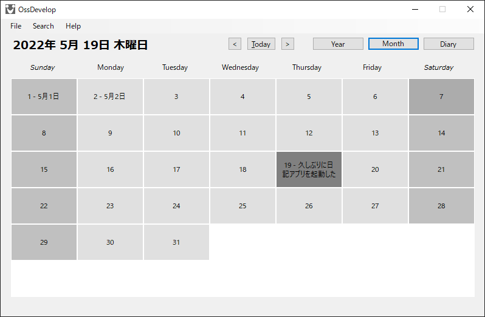

# OssDevelop

年ごと・月ごと・日ごとのカレンダーと画像も保存できる日記アプリです。

## はじめに

もっと便利なカレンダー付きの日記アプリが欲しくて「OssDevelop」を作りました。

## 必要条件

「Visual Studio 2022」「MS SQL Server」が必要です。

## データベースの準備

「MS SQL Server」に「OssDevelopDB」データベースを追加して、「dbo.DiaryTable.sql」ファイルでテーブルを作成してください。

## ビルド

「Visual Studio」で「OssDevelop.sln」ファイルを開いてビルドしてください。

## 実行

「Windows 10」以降で実行してください。

## ライセンス

[MIT License](https://raw.githubusercontent.com/roxiga/OssDevelop/main/LICENSE)
